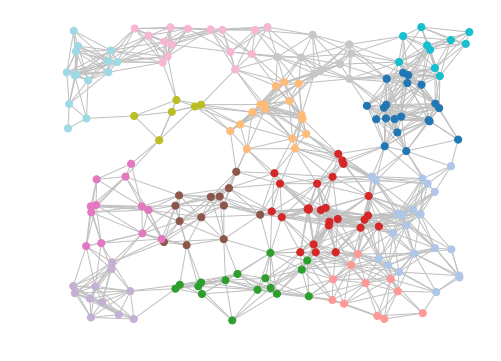
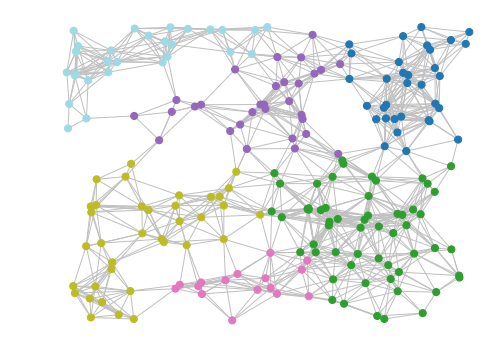
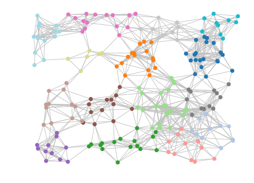

# Markov Clustering
[](http://markov-clustering.readthedocs.io/en/latest/)

This module implements of the MCL algorithm in python.

The MCL algorithm was developed by Stijn van Dongen at the University of Utrecht.

Details of the algorithm can be found on the [MCL homepage](https://micans.org/mcl/).


## Features

- Sparse matrix support
- Pruning

## Requirements

- Requirements
  - Python 3.x
  - numpy
  - scipy
  - scikit-learn
  - networkx
  - matplotlib 

- To run the tests
  - pytest


## Installation

The recommended installation method is via pip.

```
pip install markov_clustering
```


## Example



We will use NetworkX to generate the adjacency matrix for a random geometric graph which contains 200 nodes
with random coordinates ranging from (-1,-1) to (1,1). Nodes are considered adjacent if the distance between 
them is <= 0.3 units.  

This example assumes that the optional dependencies (matplotlib and networkx) have been installed

```python
import markov_clustering as mc
import networkx as nx
import random

# number of nodes to use
numnodes = 200

# generate random positions as a dictionary where the key is the node id and the value
# is a tuple containing 2D coordinates
positions = {i:(random.random() * 2 - 1, random.random() * 2 - 1) for i in range(numnodes)}

# use networkx to generate the graph
network = nx.random_geometric_graph(numnodes, 0.3, pos=positions)

# then get the adjacency matrix (in sparse form)
matrix = nx.to_scipy_sparse_matrix(network)
```

We can then run the MCL algorithm on the adjacency matrix and retrieve the clusters.
```python
result = mc.run_mcl(matrix)           # run MCL with default parameters
clusters = mc.get_clusters(result)    # get clusters
```

Finally, we can draw the results. The draw_graph function only requires the adjacency matrix and the 
cluster list, but we will pass some extra parameters such as the node positions, set the node size,
disable labels and set the color for edges.
```python
mc.draw_graph(matrix, clusters, pos=positions, node_size=50, with_labels=False, edge_color="silver")
```
This should result in an image similar to the one at the top of this section. 


If the clustering is too fine for your taste, reducing the MCL inflation parameter to 1.4 (from the default of 2)
will result in coarser clustering. e.g.
```
result = mc.run_mcl(matrix, inflation=1.4)
clusters = mc.get_clusters(result)
mc.draw_graph(matrix, clusters, pos=positions, node_size=50, with_labels=False, edge_color="silver")
```



## Choosing Hyperparameters

Choosing appropriate values for hyperparameters (e.g. cluster inflation/expansion parameters) can be difficult.  

To assist with the evaluation of the clustering quality, we include an implementation of the modularity measure.
Refer to 'Malliaros, Fragkiskos D., and Michalis Vazirgiannis. "Clustering and community detection in directed networks: A survey." Physics Reports 533.4 (2013): 95-142'
for a detailed description.  

Briefly, the modularity (Q) can be considered to be the fraction of graph edges which belong to a cluster 
minus the fraction expected due to random chance, where the value of Q lies in the range [-1, 1]. High, positive
Q values suggest higher clustering quality.  

We can use the modularity measure to optimize the clustering parameters. In the following example,
we will determine the modularity for a range of cluster inflation values, allowing us to pick the best 
cluster inflation value for the given graph.

Continuing from the previous example:

```python
# perform clustering using different inflation values from 1.5 and 2.5
# for each clustering run, calculate the modularity
for inflation in [i / 10 for i in range(15, 26)]:
    result = mc.run_mcl(matrix, inflation=inflation)
    clusters = mc.get_clusters(result)
    Q = mc.modularity(matrix=result, clusters=clusters)
    print("inflation:", inflation, "modularity:", Q)
```

```
inflation: 1.5 modularity: 0.7256870762382928
inflation: 1.6 modularity: 0.7432262129804642
inflation: 1.7 modularity: 0.7859467455621318
inflation: 1.8 modularity: 0.8030876061752096
inflation: 1.9 modularity: 0.8194196576112109
inflation: 2.0 modularity: 0.8262072262823568
inflation: 2.1 modularity: 0.8339806510839622
inflation: 2.2 modularity: 0.8307322929171664
inflation: 2.3 modularity: 0.8272367770637663
inflation: 2.4 modularity: 0.8274133182684847
inflation: 2.5 modularity: 0.8279076336416934
```

From the output, we see that an inflation value of 2.1 gives the highest modularity score,
so we will use that as our final cluster inflation parameter.

```python
# cluster using the optimized cluster inflation value
result = mc.run_mcl(matrix, inflation=2.1)
clusters = mc.get_clusters(result)
mc.draw_graph(matrix, clusters, pos=positions, node_size=50, with_labels=False, edge_color="silver")
```

